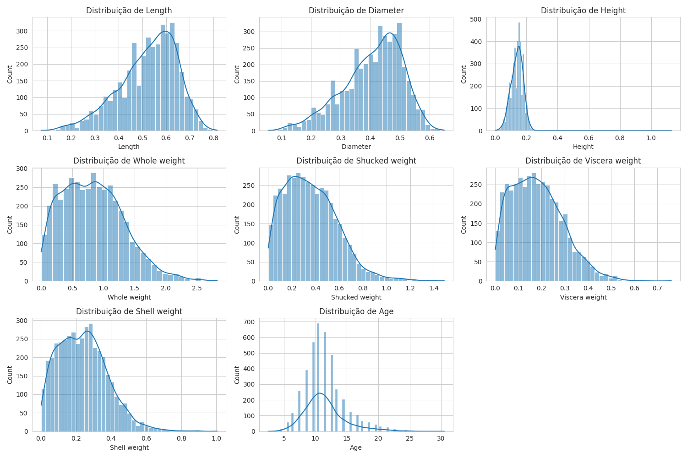
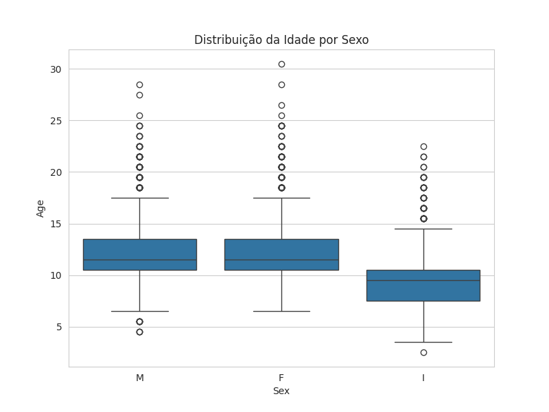
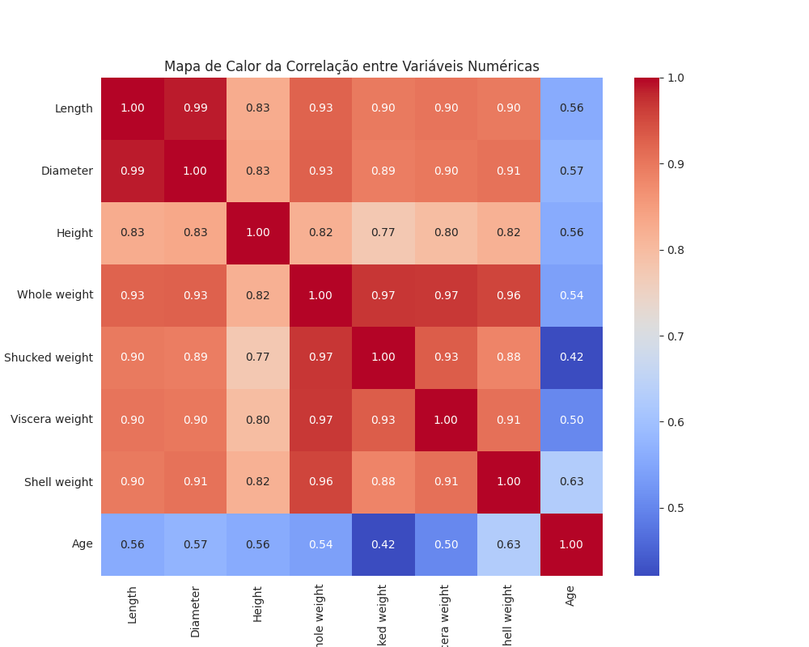

# Análise de Regressão para Predição da Idade do Abalone

## Introdução

A ideia aqui é construir um modelo de regressão linear múltipla que consiga estimar a idade do abalone a partir de medições físicas. Hoje em dia essa idade costuma ser obtida de um jeito manual e bem trabalhoso, contando os anéis na casca. O que este projeto quer descobrir é se dá para usar outras medidas, mais fáceis de coletar, para automatizar e acelerar essa predição.

## Configuração e exploração inicial dos dados

O conjunto de dados que recebemos traz várias medições físicas de abalones. Para deixar tudo mais legível, renomeei as colunas e criei uma coluna nova chamada 'Age' (Idade), calculada a partir da coluna 'Rings' (Anéis) somando 1.5, como pede a especificação do problema, de modo que a idade fique expressa em anos. Depois disso a coluna 'Rings' original foi removida.

### Informações gerais

Depois do carregamento e do pré-processamento inicial, o conjunto fica com estas características:

- Número de instâncias: 4177
- Número de variáveis: 9 (incluindo a variável alvo 'Age')

Não havia nenhum valor ausente nos dados, o que já facilita bastante o pré-processamento. Os tipos de dados também batem com cada variável: a maioria é `float64` para as medições contínuas e `object` para a variável categórica 'Sex'.

### Análise descritiva

Olhando as estatísticas das variáveis numéricas, temos o seguinte panorama:

```
            Length     Diameter       Height  Whole weight  Shucked weight  Viscera weight  Shell weight          Age
count  4177.000000  4177.000000  4177.000000   4177.000000     4177.000000     4177.000000   4177.000000  4177.000000
mean      0.523992     0.407881     0.139516      0.828742        0.359367        0.180594      0.238831    11.433684
std       0.120093     0.099240     0.041827      0.490389        0.221963        0.109614      0.139203     3.224169
min       0.075000     0.055000     0.000000      0.002000        0.001000        0.000500      0.001500     2.500000
25%       0.450000     0.350000     0.115000      0.441500        0.186000        0.093500      0.130000     9.500000
50%       0.545000     0.425000     0.140000      0.799500        0.336000        0.171000      0.234000    10.500000
75%       0.615000     0.480000     0.165000      1.153000        0.502000        0.253000      0.329000    12.500000
max       0.815000     0.650000     1.130000      2.825500        1.488000        0.760000      1.005000    30.500000
```

## Análise exploratória com visualizações

Para entender melhor os dados, gerei alguns gráficos.

### Distribuição das variáveis numéricas

Os histogramas das variáveis numéricas (Figura 1) mostram como cada característica se distribui. A maioria das variáveis tem distribuição mais ou menos normal, com algumas assimetrias. Vale reparar que a variável `Height` (Altura) chega a um valor mínimo de 0, o que pode apontar outliers ou erros de medição, e isso tem potencial para atrapalhar o desempenho do modelo.


*Figura 1: Histogramas das Variáveis Numéricas*

### Distribuição da idade por sexo

O box plot da idade por sexo (Figura 2) deixa claro que, na média, abalones machos (M) e fêmeas (F) tendem a ter idades parecidas, enquanto os infantis (I) são, como era de esperar, bem mais jovens. Em todas as categorias de sexo aparecem outliers, ou seja, abalones com idades atípicas para o grupo deles.


*Figura 2: Box Plot da Idade por Sexo*

### Mapa de calor da correlação

O mapa de calor da correlação (Figura 3) mostra a relação linear entre as variáveis numéricas. Dá para ver uma correlação alta entre as variáveis de dimensão (`Length`, `Diameter`, `Height`) e as variáveis de peso (`Whole weight`, `Shucked weight`, `Viscera weight`, `Shell weight`). Já a variável alvo `Age` (Idade) tem correlação moderada com a maioria dos preditores, sendo a mais forte com `Shell weight` (0.63) e `Diameter` (0.57). Isso sugere que essas características são as mais influentes na hora de determinar a idade do abalone.


*Figura 3: Mapa de Calor da Correlação entre Variáveis Numéricas*

## Desenvolvimento e treinamento do modelo de regressão

Para prever a idade, montei um modelo de Regressão Linear Múltipla usando a biblioteca `scikit-learn`. Antes de treinar, transformei a variável categórica `Sex` em representação numérica com One-Hot Encoding, para que ela pudesse entrar no modelo. Os dados foram divididos em treinamento (80%) e teste (20%), justamente para avaliar a capacidade de generalização.

O pipeline do modelo juntou o pré-processamento (One-Hot Encoding) e o regressor (Regressão Linear).

## Avaliação do modelo e análise dos resultados

Depois do treinamento, avaliei o modelo no conjunto de teste com as métricas R-squared (R²) e Root Mean Squared Error (RMSE).

Os resultados no conjunto de teste foram:

- R-squared (R²): 0.5482
- Root Mean Squared Error (RMSE): 2.2116

### Discussão dos resultados

O R² de cerca de 0.5482 quer dizer que aproximadamente 54.82% da variância na idade do abalone é explicada pelas variáveis preditoras do modelo. É um número que mostra que o modelo captura uma parte relevante da variabilidade, mas também deixa claro que uma fatia considerável (uns 45.18%) fica de fora. Na prática, isso significa que existem outros fatores, que não estão neste conjunto de dados, influenciando a idade, ou então que a relação entre as variáveis não é totalmente linear.

O RMSE de 2.2116 representa o desvio padrão dos resíduos, ou seja, dos erros de previsão. Traduzindo para o dia a dia: em média, as previsões de idade do modelo erram em torno de 2.21 anos para mais ou para menos em relação à idade real. Como a idade do abalone vai de 2.5 a 30.5 anos, um RMSE de 2.21 anos pode ser razoável para algumas aplicações, mas alto demais para outras que exijam mais precisão.

### Potenciais problemas e limitações do modelo

1. Linearidade: a regressão linear parte do princípio de que existe uma relação linear entre os preditores e a variável alvo. Só que a relação entre as medições físicas e a idade pode muito bem ser não linear. E a presença de outliers, como aquele que se vê em `Height`, também pode prejudicar a linearidade e o desempenho.

2. Variáveis omitidas: como já apontava a descrição original do conjunto de dados, fatores como padrões climáticos e localização (e, por consequência, disponibilidade de alimento) podem ser determinantes para prever a idade. Essas informações não estão aqui, e isso limita o quanto o modelo consegue explicar da variância.

3. Outliers: valores extremos, em especial na variável `Height` (altura zero), podem distorcer os resultados de um modelo de regressão linear, que é sensível a esse tipo de coisa. O pré-processamento inicial até removeu os valores ausentes, mas uma análise de outliers e um tratamento adequado (remoção ou transformação) provavelmente melhorariam o desempenho.

4. Variável categórica `Sex`: mesmo aplicando One-Hot Encoding, a variável `Sex` (Sexo) pode ter interações complexas com outras variáveis que um modelo linear simples não captura direito.

5. Complexidade da relação: a idade do abalone é um fenômeno biológico complicado. Pela própria simplicidade, a regressão linear talvez não dê conta de todas as nuances e interações entre as características físicas que determinam a idade. Modelos mais elaborados, como redes neurais ou modelos baseados em árvores (por exemplo, Random Forest, Gradient Boosting), poderiam chegar a um desempenho melhor.

Resumindo, a regressão linear múltipla serviu como um ponto de partida razoável para prever a idade do abalone, mas as limitações deixam claro que vale a pena explorar modelos mais avançados, incorporar variáveis adicionais e tratar os outliers de forma mais robusta para ganhar precisão nas previsões.

## Documentação e submissão

Todo o processo, incluindo o código usado, as saídas relevantes (gráficos e textos) e os comentários explicando cada etapa, está documentado neste relatório. Os gráficos gerados seguem anexados como `histograms.png`, `age_by_sex_boxplot.png` e `correlation_heatmap.png`.
